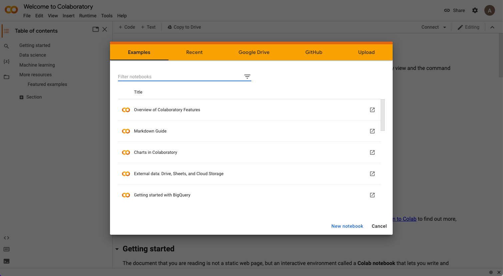
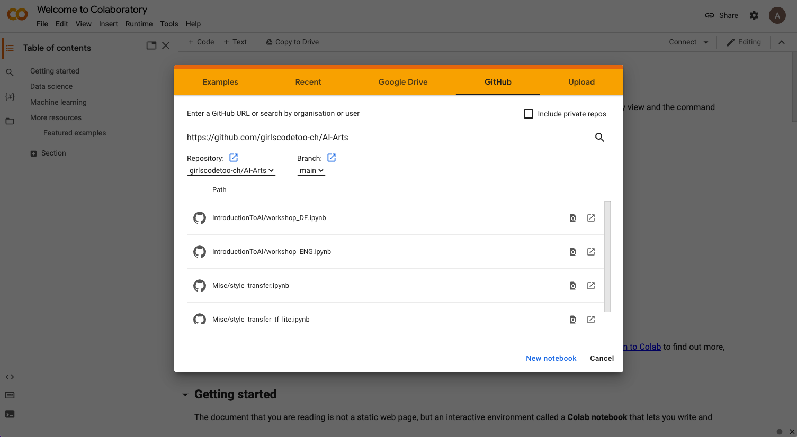
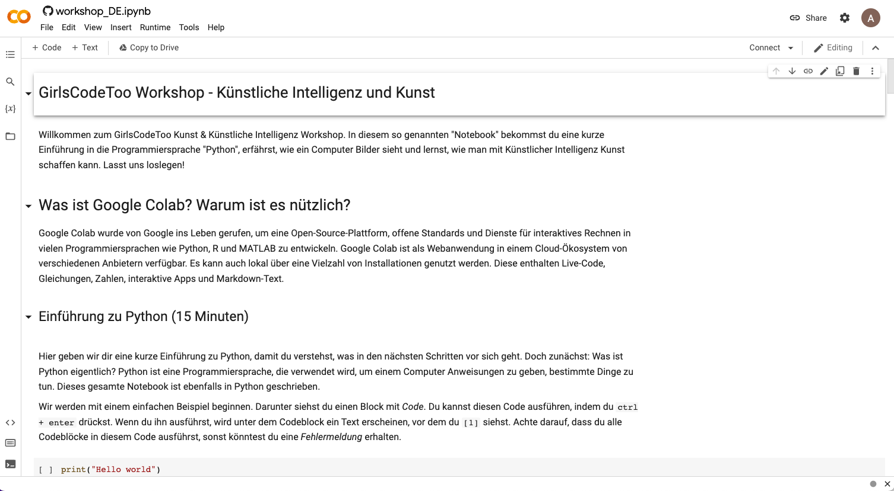

# Python mit Google Colab

Gehe auf die Website: https://colab.research.google.com/ und verbinde dich mit deinem Google-Konto. Wenn du noch kein Google-Konto hast, erstelle bitte eines. Du musst keine echten Namen oder Anmeldedaten verwenden, wenn du das nicht möchtest.

Sobald du die Website geöffnet und dich mit deinem Google-Konto verbunden hast, solltest du Folgendes auf dem Bildschirm sehen: 



Bitte gehe zum `GitHub`-Widget und gib in das Feld `Enter a GitHub URL or search by organisation or user` folgendes ein: 

```shell

https://github.com/girlscodetoo-ch/AI-Arts
```

... und klicke dann auf das Suchsymbol auf der rechten Seite des Bildschirms.

Du solltest das Folgende sehen: 



Klicke dort auf das Dokument `IntroductionToAI/workshop_DE-Teil1.ipynb`. Du solltest das Folgende sehen:



So! Jetzt bist du bereit! Folge jetzt den Anweisungen auf der Google Colab Website! Viel Glück 🍀! 

## Sources and References
- https://www.tensorflow.org/tutorials/generative/style_transfer
- https://www.tensorflow.org/lite/examples/style_transfer/overview


## Copyrights

Copyright (C) 2022 - GirlsCodeToo