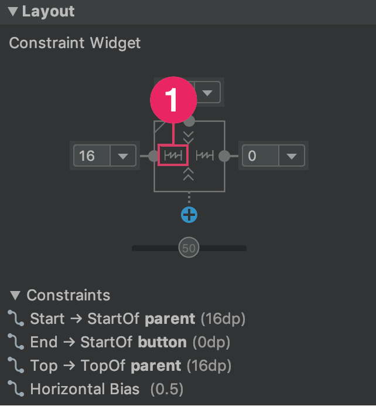

## Introduction

Welcome to this second part of the AI and Arts workshop! We are very proud of the progress you made so far. Now, we will put into practice the concepts (e.g., Front-end, Back-end, …) we learned last time and we will build on these to go far beyond! 

### Android Studio

Android was unveiled in 2007 along with the founding of Open Handset Alliance – a consortium of hardware, software, and telecommunication companies. The reason behind naming each android version after a dessert is because these devices make our life easy.

Android Studio is a Intelligent code editor, it will makes it possible to for you to write better code, work faster, and be more productive with an intelligent code editor that provides code completion for Kotlin, Java, and C/C++ languages.

Basic steps to follow for building an application for beginners:

- Design basic images for the app
- Verify that the device can support your app
- Write code to make the app work using java or language of your choice
- Create an app icon
- Review the final code

You can find more information about Android Studio [here](https://developer.android.com/studio).

### GitHub


GitHub is an essential platform for every web developer to showcase their achievements and connect with other developers, globally. Hence, it is referred to as “Social Media” for developers.

[GitHub](https://github.com/PipedreamHQ/pipedream/blob/master/components/github/readme.md?gclid=CjwKCAiAsOmABhAwEiwAEBR0ZiHilxXLMYnCk6aOhG7TpFLS4x168tTEzXcG2lGFlcXVUtCAeNtaIxoCHcIQAvD_BwE) is not only about the density of developers, but the most intrinsic fact about GitHub is also the availability of millions of repositories, even coming from tech giants such as [Facebook, Google, Microsoft](https://www.youtube.com/watch?v=vdjhil3OYYs&t=11s), and so on.

Why are we using Github? 

- According to the latest statistical reports issued around January 2020, there are over [40 million GitHub](https://github.com/search?q=type:user&type=Users) users who altogether have contributed more than [190 million repositories](https://github.com/search), out of which [28 million repositories](https://github.com/search?q=is:public) are public.
- GitHub projects are not at all saturated, you can clone or upload all sorts of repositories, design-based, websites, mobile applications, games, and so on.
- You can add multiple collaborators to your repository and accept commits globally.
- You can even view the source code and collaborate with the most renowned tech-giant: Google, recently, Google has accepted code merges from a few independent developers.

### Android Basics

- Android apps are built as a combination of components that can be invoked individually. For example, an *activity* is a type of app component that provides a user interface (UI).
- The "main" activity starts when the user taps your app's icon. You can also direct the user to an activity from elsewhere, such as from a notification or even from a different app.
- Other components, such as *WorkManager*, allow your app to perform background tasks without a UI.
- Other fundamentals: https://developer.android.com/guide/components/fundamentals

## Part 0 - Where to start?

If you are using a laptop provided by GirlsCodeToo, please skip Part 1 - Installing Android Studio and directly go to `Part 2 - Create your first app`

## Part 1 - Installing Android Studio

Android Studio provides the fastest tools for building apps on every type of Android device.

- Go to https://developer.android.com/studio

### MacOS

To install Android Studio your Mac need to fullfil the following requirements:

```
MacOS® 10.14 (Mojave) or higher
ARM-based chips, or 2nd generation Intel Core or newer with support for Hypervisor.Framework
8 GB RAM or more
8 GB of available disk space minimum (IDE + Android SDK + Android Emulator)
1280 x 800 minimum screen resolution
```

If your Mac fulfils these requirements then please follow these instructions: 

1. Click on `Download Android Studio`. 


2. Accept the terms and click on `Download Android Studio for Mac` this will launch the download Android Studio on your laptop.


3. Save the document to the `Download` folder and wait until the end of the download. 

4. Open the `Download` folder on your laptop and double-click on the file you just downloaded. The name of the file should be something like: `android-studio-ide-202.7351085-mac.dmg` 

### 

5. Slide the `Android Studio.app` to the `Applications` folder

   

6. Wait until the program is installed and open the `Launchpad`
   

7. Look for the Android Studio App and click on it. The Android Studio app should look something like this: 

   

   

### Windows

To install Android Studio your PC need to fullfil the following requirements:

```
64-bit Microsoft® Windows® 8/10
x86_64 CPU architecture; 2nd generation Intel Core or newer, or AMD CPU with support for a Windows Hypervisor
8 GB RAM or more
8 GB of available disk space minimum (IDE + Android SDK + Android Emulator)
1280 x 800 minimum screen resolution
```

# Part 2 - Create your first app

This section follows quite closely the official Android tutorial proposed by Android to teach young programmer how to created their first app in Android using Android Studio. If you prefer to follow the tutorial from the website online, please click [here](https://developer.android.com/training/basics/firstapp)! Good luck 🍀! 

This section describes how to build a simple Android app. First, you learn how to create a "Hello, World!" project with Android Studio and run it. Then, you create a new interface for the app that takes user input and switches to a new screen in the app to display it.

Before you start, there are two fundamental concepts that you need to understand about Android apps: how they provide multiple entry points, and how they adapt to different devices.

This lesson shows you how to create a new Android project with Android Studio, and it describes some of the files in the project.

## Create your first Android App

To create your new Android project, follow these steps:

1. Install the latest version of [Android Studio](https://developer.android.com/studio/) (see Part I for more details)

2. In the **Welcome to Android Studio** window, click **Create New Project**.

   

   ​					**Figure 1.** Android Studio welcome screen.

   **NOTE:**  if you have a project already opened, select **File > New > New Project**.

3. In the **Select a Project Template** window, select **Empty Activity** and click **Next**.

4. In the Configure your project window, complete the following:

   - Enter "My First App" in the **Name** field.

   - Enter "com.example.myfirstapp" in the **Package name** field.

   - If you'd like to place the project in a different folder, change its **Save** location.

   - You can select either **Java** or **Kotlin** from the **Language** drop-down menu.

     - Please select **Java**

   - Select the lowest version of Android you want your app to support in the **Minimum SDK** field.

     - Please select Minimum SDK version 18

     ```
     Note: The Help me choose link opens the Android Platform/API Version Distribution dialog. This dialog provides information about the various versions of Android that are distributed among devices. The key tradeoff to consider is the percentage of Android devices you want to support versus the amount of work to maintain your app on each of the different versions that those devices run on. For example, if you choose to make your app compatible with many different versions of Android, you increase the effort that's required to maintain compatibility between the oldest and newest versions.
     ```

   - If your app will require legacy library support, mark the **Use legacy android.support libraries** checkbox.

   - Leave the other options as they are.
     

5. Click **Finish**. Android Studio should now start to process some things. Then click on **Finish** again.

After some processing time, the Android Studio main window appears.


​						**Figure 2.** Android Studio main window.

Now take a moment to review the most important files.

First, be sure the **Project** window is open (select **View > Tool Windows > Project**) and the Android view is selected from the drop-down list at the top of that window. You can then see the following files:

- **app > java > com.example.myfirstapp > MainActivity**

  This is the **main activity**. It's the entry point for your app. When you build and run your app, the system launches an instance of this `Activity` and loads its layout.

- **app > res > layout > activity_main.xml**

  This XML file defines the layout for the activity's user interface (UI). It contains a `TextView` element with the text "Hello, World!"

- **app > manifests > AndroidManifest.xml**

  The [manifest file](https://developer.android.com/guide/topics/manifest/manifest-intro) describes the fundamental characteristics of the app and defines each of its components.

- **Gradle Scripts > build.gradle**

  There are two files with this name: one for the project, "Project: My_First_App," and one for the app module, "Module: My_First_App.app." Each module has its own `build.gradle` file, but this project currently has just one module. Use each module's `build.gradle` file to control how the [Gradle plugin](https://developer.android.com/studio/releases/gradle-plugin) builds your app. For more information about this file, see [Configure your build](https://developer.android.com/studio/build#module-level).

Now you have created an Android app that displays "Hello, World!" You can now run the app on a real device or an emulator.

## Run on a real device (Optional)

If you are the owner of a Android Phone, you can install the app that we will develop in this class on your phone and play with it. 🥳 **If you do not have an Android Phone**, that no problem we can emulate the phone directly on your computer, which is super fun as well. 

Set up your device as follows:

1. Connect your device to your development machine with a USB cable. If you developed on Windows, you might need to [install the appropriate USB driver](https://developer.android.com/studio/run/oem-usb) for your device.
2. Perform the following steps to enable USB debugging in the Developer options window:
   1. Open the **Settings** app.
   2. If your device uses Android v8.0 or higher, select **System**. Otherwise, proceed to the next step.
   3. Scroll to the bottom and select **About phone**.
   4. Scroll to the bottom and tap **Build number** seven times.
   5. Return to the previous screen, scroll to the bottom, and tap **Developer options**.
   6. In the **Developer options** window, scroll down to find and enable **USB debugging**.

Run the app on your device as follows:

1. In Android Studio, select your app from the run/debug configurations drop-down menu in the toolbar.
2. In the toolbar, select the device that you want to run your app on from the target device drop-down menu.


**Figure 1.** Target device drop-down menu


1. Click **Run** .

   Android Studio installs your app on your connected device and starts it. You now see "Hello, World!" displayed in the app on your device.

To begin to develop your app, continue to the [next lesson](https://developer.android.com/training/basics/firstapp/building-ui).

## Run on an emulator

Run the app on an emulator as follows:

1. In Android Studio, [create an Android Virtual Device (AVD)](https://developer.android.com/studio/run/managing-avds#createavd) that the emulator can use to install and run your app. To create a new AVD:

   1. Open the AVD Manager by clicking **Tools > AVD Manager**. 

   2. Click Create Virtual Device, at the bottom of the AVD Manager dialog. The **Select Hardware** page appears. Here you can try the **Pixel 3** emulator.

      

      Notice that only some hardware profiles are indicated to include **Play Store**. This indicates that these profiles are fully [CTS](https://source.android.com/compatibility/cts/) compliant and may use system images that include the Play Store app.

   3. Select a hardware profile, and then click **Next**.

   4. If you don't see the hardware profile you want, you can [create](https://developer.android.com/studio/run/managing-avds#createhp) or [import](https://developer.android.com/studio/run/managing-avds#importexporthp) a hardware profile.

   5. The **System Image** page appears.

   6. 

   7. Please select **Q** as the image to install on the phone (you might need to download it first)

   8. Select the system image for a particular API level, and then click **Next**.

   9. The **Recommended** tab lists recommended system images. The other tabs include a more complete list. The right pane describes the selected system image. x86 images run the fastest in the emulator.

   10. If you see **Download** next to the system image, you need to click it to download the system image. You must be connected to the internet to download it.

   11. The API level of the target device is important, because your app won't be able to run on a system image with an API level that's less than that required by your app, as specified in the [`minSdkVersion`](https://developer.android.com/guide/topics/manifest/uses-sdk-element) attribute of the app manifest file. For more information about the relationship between system API level and `minSdkVersion`, see [Versioning Your Apps](https://developer.android.com/studio/publish/versioning).

   12. If your app declares a [``](https://developer.android.com/guide/topics/manifest/uses-library-element) element in the manifest file, the app requires a system image in which that external library is present. If you want to run your app on an emulator, create an AVD that includes the required library. To do so, you might need to use an add-on component for the AVD platform; for example, the Google APIs add-on contains the Google Maps library.

   13. The **Verify Configuration** page appears.

   14. 

   15. Change AVD properties as needed, and then click **Finish**.

       Click **Show Advanced Settings** to show more settings, such as the skin.

   16. The new AVD appears in the **Your Virtual Devices** page or the **Select Deployment Target** dialog.

   To create an AVD starting with a copy:

   1. From the [**Your Virtual Devices**](https://developer.android.com/studio/run/managing-avds#viewing) page of the AVD Manager, right-click an AVD and select **Duplicate**.
   2. Or click Menu  and select **Duplicate**.

   3. The [**Verify Configuration**](https://developer.android.com/studio/run/managing-avds#verifyconfigpage) page appears.

   4. Click **Change** or **Previous** if you need to make changes on the [**System Image**](https://developer.android.com/studio/run/managing-avds#systemimagepage) and [**Select Hardware**](https://developer.android.com/studio/run/managing-avds#selecthardwarepage) pages.
   5. Make your changes, and then click **Finish**.
   6. The AVD appears in the **Your Virtual Devices** page.

   If you have some problems, you can find more information [here](https://developer.android.com/studio/run/managing-avds#createavd). 

2. In the toolbar, select your app from the run/debug configurations drop-down menu.

3. From the target device drop-down menu, select the AVD that you want to run your app on.

   

   **Figure 2.** Target device drop-down menu

   

4. Click **Run** .

   Android Studio installs the app on the AVD and starts the emulator. You now see "Hello, World!" displayed in the app.

This can take a few minutes, but essentially you should be able to see the following after a few minutes: 


# Part 3 - Develop your own App

In this lesson, you learn how to use the [Android Studio Layout Editor](https://developer.android.com/studio/write/layout-editor) to create a layout that includes a, so called `text box` and a `button`. This sets up the next lesson, where you learn how to make the app send the content of the text box to another activity when the button is tapped.


**Figure 1.** Screenshot of the final layout

The user interface (UI) for an Android app is built as a hierarchy of *layouts* and *widgets*. The layouts are [`ViewGroup`](https://developer.android.com/reference/android/view/ViewGroup) objects, containers that control how their child views are positioned on the screen. Widgets are [`View`](https://developer.android.com/reference/android/view/View) objects, UI components such as buttons and text boxes.


**Figure 2.** Illustration of how `ViewGroup` objects form branches in the layout and contain `View` objects.

Android provides an XML vocabulary for `ViewGroup` and `View` classes, so most of your UI is defined in XML files. However, rather than teach you to write XML, this lesson shows you how to create a layout using Android Studio's Layout Editor. The Layout Editor writes the XML for you as you drag and drop views to build your layout.

## Open the Layout Editor

To get started, set up your workspace as follows:

1. In the Project window, open **app > res > layout > activity_main.xml**.
2. To make room for the Layout Editor, hide the **Project** window. To do so, select **View > Tool Windows > Project**, or just click **Project** on the left side of the Android Studio screen.
3. If your editor shows the XML source, click the **Design** tab at the top right of the window.
   
4. Click  (**Select Design Surface**) and select **Blueprint**.
5. Click  (**View Options**) in the Layout Editor toolbar and make sure that **Show All Constraints** is checked.
6. Make sure Autoconnect is off. A tooltip in the toolbar displays  (**Enable Autoconnection to Parent**) when Autoconnect is off.
   
7. Click  (**Default Margins**) in the toolbar and select **16**. If needed, you can adjust the margins for each view later.
8. Click  (**Device for Preview**) in the toolbar and select **5.5, 1080 × 2160, 440 dpi (Pixel 3)**.

Your Layout Editor now looks as shown in figure 3.


**Figure 3.** The Layout Editor showing `activity_main.xml`

For additional information, see [Introduction to the Layout Editor](https://developer.android.com/studio/write/layout-editor#intro).

The **Component Tree** panel on the bottom left shows the layout's hierarchy of views. In this case, the root view is a `ConstraintLayout`, which contains just one `TextView` object.


`ConstraintLayout` is a layout that defines the position for each view based on constraints to sibling views and the parent layout. In this way, you can create both simple and complex layouts with a flat view hierarchy. This type of layout avoids the need for nested layouts. A nested layout, which is a layout inside a layout, as shown in figure 2, can increase the time required to draw the UI.


**Figure 4.** Illustration of two views positioned inside `ConstraintLayout`

For example, you can declare the following layout, which is shown in figure 4:

- View A appears 16 dp from the top of the parent layout.
- View A appears 16 dp from the left of the parent layout.
- View B appears 16 dp to the right of view A.
- View B is aligned to the top of view A.

In the following sections, you'll build a layout similar to the layout in figure 4.

## Add a text box

Follow these steps to add a text box:

1. First, you need to remove what's already in the layout. Click **TextView** in the **Component Tree** panel and then press the Delete key.
2. In the **Palette** panel, click **Text** to show the available text controls.
3. Drag the **Plain Text** into the design editor and drop it near the top of the layout. This is an `EditText` widget that accepts plain text input.
4. Click on the object you just dragged and droped in the **design editor**. You can now see the square handles to resize the view on each corner, and the circular constraint anchors on each side. 
   **NOTE**: For better control, you might want to zoom in on the editor. To do so, use the **Zoom** buttons in the Layout Editor toolbar.
   
5. Click and hold the anchor on the top side, drag it up until it snaps to the top of the layout, and then release it. That's a constraint: it constrains the view within the default margin that was set. In this case, you set it to 16 dp from the top of the layout.
   This is the anchor —> 
6. Use the same process to create a constraint from the left side of the view to the left side of the layout. Meaning, click on the anchor on the left side and drag it until the left border of the **design editor**.

The result should look as shown in **figure 5.**


​			**Figure 5.** The text box is constrained to the top and left of the parent layout

## Add a button

1. In the **Palette** panel, click **Buttons**.
2. Drag the **Button** widget into the design editor and drop it near the right side.
3. Create a constraint from the **left side of the button** to the **right side of the text box**.
4. To constrain the views in a horizontal alignment, create a constraint between the text baselines. To do so, right-click the button and then select **Show Baseline** . The baseline anchor appears inside the button. Click and hold this anchor, and then drag it to the baseline anchor that appears in the adjacent text box.

The result should look as shown in figure 6.


**Figure 6.** The button is constrained to the right side of the text box and its baseline

**Note:** You can also use the top or bottom edges to create a horizontal alignment. However, the button image includes padding around it, so the visual alignment is wrong if created that way.

## Change the UI strings

To preview the UI, click  (**Select Design Surface**) in the toolbar and select **Design**. Notice that the text input and button label are set to default values.

Follow these steps to change the UI strings:

1. Open the **Project window** and then open **app > res > values > strings.xml**.

   This is a [string resources](https://developer.android.com/guide/topics/resources/string-resource) file, where you can specify all of your UI strings. It allows you to manage all of your UI strings in a single location, which makes them easier to find, update, and localize.

2. Click **Open editor** at the top of the window. This opens the [Translations Editor](https://developer.android.com/studio/write/translations-editor), which provides a simple interface to add and edit your default strings. It also helps you keep all of your translated strings organized.

3. 

4. Click  (**Add Key**) to create a new string as the "hint text" for the text box. At this point, the window shown in figure 7 opens.

   

   **Figure 7.** The dialog to add a new string

   

   In the **Add Key** dialog box, complete the following steps:

   1. Enter "edit_message" in the **Key** field.
   2. Enter "Enter a message" in the **Default Value** field.
   3. Click **OK**.

5. Add another key named "**button_send**" with a value of "**Send**”. In the end you should see this. 
   

Now you can set these strings for each view. To return to the layout file, click **activity_main.xml** in the tab bar. Then, add the strings as follows:

1. Click the text box in the layout. If the **Attributes** window isn't already visible on the right, click **Attributes** on the right sidebar.

   

   

   

2. Locate the **text** property, which is currently set to "Name," and delete the value.

3. Locate the **hint** property and then click  (**Pick a Resource**), which is to the **right of the text box**. In the dialog that appears, double-click **edit_message** from the list.

4. Click the button in the layout and locate its **text** property, which is currently set to "Button." Then, click  (**Pick a Resource**) and select **button_send**.

## Make the text box size flexible

To create a layout that's responsive to different screen sizes, you need to make the text box stretch to fill all the horizontal space that remains after the button and margins are accounted for.

Before you continue, click  (**Select Design Surface**) in the toolbar and select **Blueprint**.

To make the text box flexible, follow these steps:

1. Select both views. To do so, click one, hold Shift, then click the other, and then right-click either one and select **Chains > Create Horizontal Chain**. The layout then appears as shown in figure 8.

   **Figure 8.** The result of choosing **Create Horizontal Chain**

2. Select the button and open the **Attributes** window. Then, use the **Constraint Widget** to set the right margin to 16 dp.

3. Click the text box to view its attributes. Then, click the width indicator twice so it's set to a jagged line (**Match Constraints**), as indicated by callout 1 in figure 9.

   **Figure 9.** Click to change the width to **Match Constraints**
   

   In the end you should see this. 

Now the layout is done, as shown in figure 10.


**Figure 10.** The text box now stretches to fill the remaining space

If your layout didn't turn out as expected, click **See the final layout XML** below to see what your XML should look like. Compare it to what you see in the **Code** tab. If your attributes appear in a different order, that's okay.

See the final layout XML

For more information about chains and all the other things you can do with `ConstraintLayout`, read [Build a Responsive UI with ConstraintLayout](https://developer.android.com/training/constraint-layout).

## Run the app

If your app is already installed on the device from [the previous lesson](https://developer.android.com/training/basics/firstapp/running-app), simply click  (**Apply Changes**) in the toolbar to update the app with the new layout. Or, click  **Run 'app'** to install and run the app.


# Part 4 - Add second page to our App

You now have an app that shows an activity that consists of a single screen with a text field and a **Send** button. In this lesson, you add some code to the `MainActivity` that starts a new activity to display a message when the user taps the **Send** button.

## Respond to the Send button

Follow these steps to add a method to the `MainActivity` class that's called when the **Send** button is tapped:

1. In the file **app > java > com.example.myfirstapp > MainActivity**, add the following `sendMessage()` method stub:

   ```java
   public class MainActivity extends AppCompatActivity {
       @Override
       protected void onCreate(Bundle savedInstanceState) {
           super.onCreate(savedInstanceState);
           setContentView(R.layout.activity_main);
       }
   
       /** Called when the user taps the Send button */
       public void sendMessage(View view) {
           // Do something in response to button
       }
   }
   ```

   You might see an error because Android Studio cannot resolve the `View` class used as the method argument. To clear the error, click the `View` declaration, place your cursor on it, and then press Alt+Enter, or Option+Enter on a Mac, to perform a Quick Fix. If a menu appears, select **Import class**.

2. Return to the **activity_main.xml** file to call the method from the button:

   1. Select the button in the Layout Editor.
   2. In the **Attributes** window, locate the **onClick** property and select **sendMessage [MainActivity]** from its drop-down list.
      

   Now when the button is tapped, the system calls the `sendMessage()` method.

   Take note of the details in this method. They're required for the system to recognize the method as compatible with the [`android:onClick`](https://developer.android.com/reference/android/view/View#attr_android:onClick) attribute. 
   Specifically, the method has the following characteristics:

   - Public access.
   - A void 
   - A `View` as the only parameter. This is the `View` object you clicked at the end of Step 1.

3. Next, fill in this method to read the contents of the text field and deliver that text to another activity.

We now need to show to the app that our intent is to switch to a new page. 

An `Intent` is an object that provides runtime binding between separate components, such as two activities. The `Intent` represents an app’s intent to do something. You can use intents for a wide variety of tasks, but in this lesson, your intent starts another activity.

In `MainActivity`, add the `EXTRA_MESSAGE` constant and the `sendMessage()` code, as shown:

```java
public class MainActivity extends AppCompatActivity {
    public static final String EXTRA_MESSAGE = "com.example.myfirstapp.MESSAGE";
    @Override
    protected void onCreate(Bundle savedInstanceState) {
        super.onCreate(savedInstanceState);
        setContentView(R.layout.activity_main);
    }

    /** Called when the user taps the Send button */
    public void sendMessage(View view) {
        Intent intent = new Intent(this, DisplayMessageActivity.class);
        EditText editText = (EditText) findViewById(R.id.editText);
        String message = editText.getText().toString();
        intent.putExtra(EXTRA_MESSAGE, message);
        startActivity(intent);
    }
}
```

Expect Android Studio to encounter **Cannot resolve symbol** errors again. To clear the errors, press Alt+Enter, or Option+Return on a Mac. Your should end up with the following imports:

```java
import androidx.appcompat.app.AppCompatActivity;
import android.content.Intent;
import android.os.Bundle;
import android.view.View;
import android.widget.EditText;
```

An error still remains for `DisplayMessageActivity`, but that's okay. You fix it in the next section.

Here's what's going on in `sendMessage()`:

- The `Intent` constructor takes two parameters, a `Context` and a `Class`.

  The `Context` parameter is used first because the `Activity` class is a subclass of `Context`.

  The `Class` parameter of the app component, to which the system delivers the `Intent,` is, in this case, the activity to start.

- The `putExtra()` method adds the value of `EditText` to the intent. An `Intent` can carry data types as key-value pairs called *extras*.

  Your key is a public constant `EXTRA_MESSAGE` because the next activity uses the key to retrieve the text value. It's a good practice to define keys for intent extras with your app's package name as a prefix. This ensures that the keys are unique, in case your app interacts with other apps.

- The `startActivity()` method starts an instance of the `DisplayMessageActivity` that's specified by the `Intent`. Next, you need to create that class.

**Note:** The Navigation Architecture Component allows you to use the Navigation Editor to associate one activity with another. Once the relationship is made, you can use the API to start the second activity when the user triggers the associated action, such as when the user clicks a button. To learn more, see [Navigation](https://developer.android.com/topic/libraries/architecture/navigation).

## Create the second activity

To create the second activity, follow these steps:

1. In the **Project** window, right-click the **app** folder and select **New > Activity > Empty Activity**.
2. In the **Configure Activity** window, enter "DisplayMessageActivity" for **Activity Name**. Leave all other properties set to their defaults and click **Finish**. Then on the next window click on **Add**.

Android Studio automatically does three things:

- Creates the `DisplayMessageActivity` file.
- Creates the layout file `activity_display_message.xml`, which corresponds with the `DisplayMessageActivity` file.
- Adds the required `<activity>`element in `AndroidManifest.xml`.

If you run the app and tap the button on the first activity, the second activity starts but is empty. This is because the second activity uses the empty layout provided by the template.

## Add a text view

The new activity includes a blank layout file. Follow these steps to add a text view to where the message appears:

1. Open the file **app > res > layout > activity_display_message.xml**.
2. Click **Enable Autoconnection to Parent**  in the toolbar. This enables Autoconnect. See figure 1.
3. In the **Palette** panel, click **Text**, drag a **TextView** into the layout, and drop it near the top-center of the layout so that it snaps to the vertical line that appears. Autoconnect adds left and right constraints in order to place the view in the horizontal center.
4. Create one more constraint from the top of the text view to the top of the layout, so that it appears as shown in figure 1.
5. **Figure 1.** The text view centered at the top of the layout.

Optionally, you can make some adjustments to the text style if you expand **textAppearance** in the **Common Attributes** panel of the **Attributes** window, and change attributes such as **textSize** and **textColor**.

## Display the message

In this step, you modify the second activity to display the message that was passed by the first activity.

1. In `DisplayMessageActivity`, add the following code to the `onCreate()` method:

   ```java
   @Override
   protected void onCreate(Bundle savedInstanceState) {
       super.onCreate(savedInstanceState);
       setContentView(R.layout.activity_display_message);
       
       // Get the Intent that started this activity and extract the string
       Intent intent = getIntent();
       String message = intent.getStringExtra(MainActivity.EXTRA_MESSAGE);
   
       // Capture the layout's TextView and set the string as its text
       TextView textView = findViewById(R.id.textView);
       textView.setText(message);
   }
   ```

2. Press Alt+Enter, or Option+Return on a Mac, to import these other needed classes:

   ```java
   import androidx.appcompat.app.AppCompatActivity;
   import android.content.Intent;
   import android.os.Bundle;
   import android.widget.TextView;
   ```

## Add upward navigation

Each screen in your app that's not the main entry point, which are all the screens that aren't the home screen, must provide navigation that directs the user to the logical parent screen in the app's hierarchy. To do this, add an **Up** button in the [app bar](https://developer.android.com/training/appbar).

To add an **Up** button, you need to declare which activity is the logical parent in the [`AndroidManifest.xml`](https://developer.android.com/guide/topics/manifest/manifest-intro) file. Open the file at **app > manifests > AndroidManifest.xml**, locate the `<activity>` tag for `DisplayMessageActivity`, and replace it with the following:

```xml
<activity android:name=".DisplayMessageActivity"
          android:parentActivityName=".MainActivity">
    <!-- The meta-data tag is required if you support API level 15 and lower -->
    <meta-data
        android:name="android.support.PARENT_ACTIVITY"
        android:value=".MainActivity" />
</activity>
```

The Android system now automatically adds the **Up** button to the app bar.

**BEFORE**


**AFTER**


## Run the app

Click **Apply Changes**  in the toolbar to run the app. When it opens, type a message in the text field and tap **Send** to see the message appear in the second activity.

**Figure 2.** App opened, with text entered on the left screen and displayed on the right.

That's it, you've built your first Android app!

# Additional Ressources

- https://www.youtube.com/user/androiddevelopers
- https://developer.android.com/training/basics/firstapp


# Part 5 - Photo Style Transfer on Android

We will now reuse all the knowledge you gained this morning regarding AI and how to train an artificial intelligence. The goal of this part will be to use the models you trained this morning on your mobile phone.

Please go back to `Android Studio` do the following: 

Go to `File` > `Close Project`, you should then see the following screen:


Then go to `Get from VCS` and enter the following URL: https://github.com/girlscodetoo-ch/AI-Arts.git. 