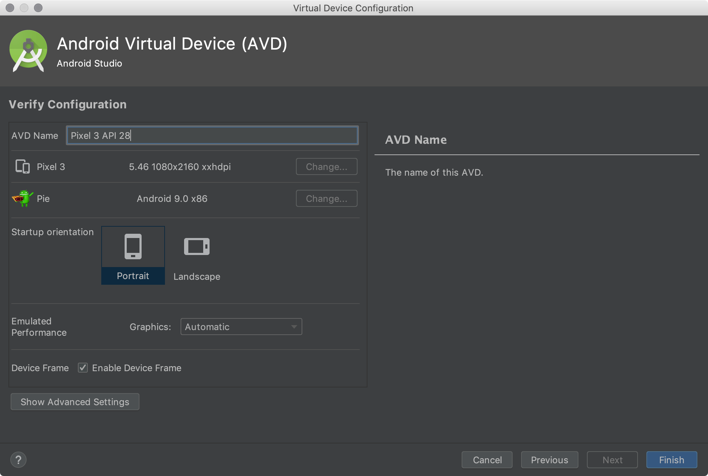
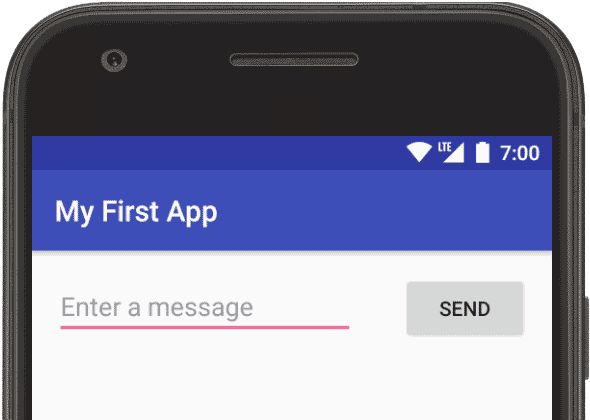
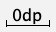
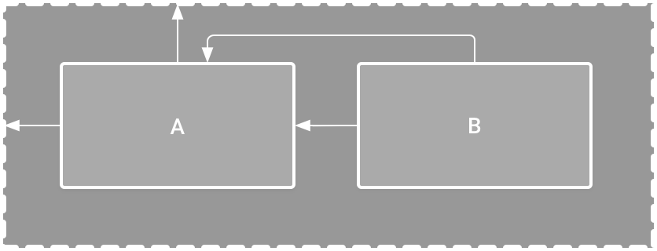
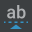
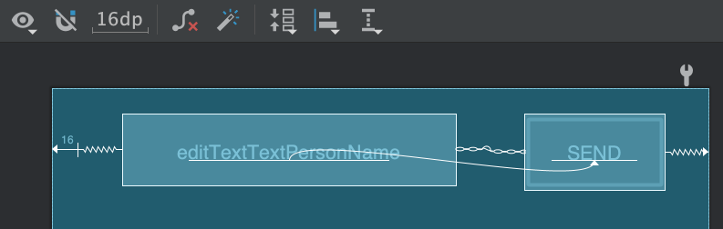

## Einleitung

Willkommen zum zweiten Teil des Workshops "KI und Kunst"! Wir sind sehr stolz auf die Fortschritte, die du bis jetzt gemacht hast. Jetzt werden wir die Konzepte (z.B. Front-End, Back-End, ...), die wir beim letzten Mal gelernt haben, in die Praxis umsetzen und darauf aufbauen, um weit darüber hinauszugehen! 

### Android Studio

Android wurde 2007 zusammen mit der Gründung der Open Handset Alliance - einem Konsortium aus Hardware-, Software- und Telekommunikationsunternehmen - vorgestellt. Der Grund, warum jede Android-Version nach einem Dessert benannt wurde, ist, dass diese Geräte unser Leben einfacher machen.

Android Studio ist ein intelligenter Code-Editor, der es dir ermöglicht, besseren Code zu schreiben, schneller zu arbeiten und produktiver zu sein - mit einem intelligenten Code-Editor, der Code-Vervollständigung für die Sprachen Kotlin, Java und C/C++ bietet.

Grundlegende Schritte für die Erstellung einer Anwendung für Anfänger:

- Entwirf grundlegende Bilder für die App
- Überprüfe, ob das Gerät deine App unterstützen kann
- Schreibe den Code für die App mit Java oder einer anderen Sprache deiner Wahl
- Erstelle ein App-Symbol
- Überprüfe den endgültigen Code

Weitere Informationen zu Android Studio findest du [hier](https://developer.android.com/studio).

### GitHub


GitHub ist eine wichtige Plattform für jeden Webentwickler, um seine Leistungen zu präsentieren und sich mit anderen Entwicklern weltweit zu vernetzen. Daher wird es auch als "Social Media" für Entwickler bezeichnet.

Bei [GitHub](https://github.com/PipedreamHQ/pipedream/blob/master/components/github/readme.md?gclid=CjwKCAiAsOmABhAwEiwAEBR0ZiHilxXLMYnCk6aOhG7TpFLS4x168tTEzXcG2lGFlcXVUtCAeNtaIxoCHcIQAvD_BwE) geht es nicht nur um die Dichte an Entwicklern, sondern vor allem um die Verfügbarkeit von Millionen von Repositories, die sogar von Tech-Giganten wie [Facebook, Google, Microsoft](https://www.youtube.com/watch?v=vdjhil3OYYs&t=11s) usw. stammen.

Warum nutzen wir Github? 

- Laut den letzten statistischen Berichten, die im Januar 2020 veröffentlicht wurden, gibt es über [40 Millionen GitHub](https://github.com/search?q=type:user&type=Users) Nutzer, die insgesamt mehr als [190 Millionen Repositories](https://github.com/search) beigetragen haben, von denen [28 Millionen Repositories](https://github.com/search?q=is:public) öffentlich sind.
- GitHub-Projekte sind keineswegs gesättigt. Du kannst alle Arten von Repositories klonen oder hochladen, z. B. designbasierte Projekte, Websites, mobile Anwendungen, Spiele und so weiter.
- Du kannst mehrere Mitwirkende zu deinem Repository hinzufügen und Commits global akzeptieren.
- Du kannst sogar den Quellcode einsehen und mit dem bekanntesten Tech-Giganten zusammenarbeiten: Google hat kürzlich Codezusammenführungen von einigen unabhängigen Entwicklern akzeptiert.

... oder wie Scott es zusammen fassen würde: 


### Android-Grundlagen

- Android-Apps bestehen aus einer Kombination von Komponenten, die einzeln aufgerufen werden können. Eine *Aktivität* ist zum Beispiel eine Art App-Komponente, die eine Benutzeroberfläche (UI) bereitstellt.
- Die "Hauptaktivität" wird gestartet, wenn der Nutzer auf das Symbol deiner App tippt. Du kannst den Nutzer auch von einer anderen Stelle aus zu einer Aktivität leiten, z. B. über eine Benachrichtigung oder sogar aus einer anderen App.
- Andere Komponenten, wie z. B. *WorkManager*, ermöglichen es deiner App, Hintergrundaufgaben ohne eine Benutzeroberfläche auszuführen.
- Andere Grundlagen: https://developer.android.com/guide/components/fundamentals

## Teil 0 - Wo fange ich an?

Wenn du einen von GirlsCodeToo zur Verfügung gestellten Laptop verwendest, überspringe bitte Teil 1 - Installation von Android Studio und gehe direkt zu `Teil 2 - Erstelle deine erste App`.

## Teil 1 - Installation von Android Studio

Android Studio bietet die schnellsten Werkzeuge, um Apps für alle Arten von Android-Geräten zu erstellen.

- Gehe zu https://developer.android.com/studio

## MacOS

Um Android Studio zu installieren, muss dein Mac die folgenden Voraussetzungen erfüllen:

```
MacOS® 10.14 (Mojave) oder höher
ARM-basierte Chips oder Intel Core der 2. Generation oder neuer mit Unterstützung für Hypervisor.Framework
8 GB RAM oder mehr
Mindestens 8 GB verfügbarer Festplattenspeicher (IDE + Android SDK + Android Emulator)
Bildschirmauflösung von mindestens 1280 x 800
```

Wenn dein Mac diese Anforderungen erfüllt, befolge bitte die folgenden Anweisungen: 

1. Klicke auf "Android Studio herunterladen". 


2. Akzeptiere die Bedingungen und klicke auf "Android Studio für Mac herunterladen", um den Download von Android Studio auf deinem Laptop zu starten.


3. Speichere das Dokument im Ordner `Download` und warte bis zum Ende des Downloads. 

4. Öffne den Ordner `Download` auf deinem Laptop und doppelklicke auf die Datei, die du gerade heruntergeladen hast. Der Name der Datei sollte ungefähr so lauten: `android-studio-ide-202.7351085-mac.dmg` 

### 

5. Schiebe die `Android Studio.app` in den Ordner `Applications`.

   

6. Warte, bis das Programm installiert ist und öffne das `Launchpad`
   

7. Suche nach der Android Studio App und klicke sie an. Die Android Studio App sollte ungefähr so aussehen: 

   

   

### Windows

Um Android Studio zu installieren, muss dein PC die folgenden Voraussetzungen erfüllen:

```
64-Bit Microsoft® Windows® 8/10
x86_64 CPU-Architektur; Intel Core der 2. Generation oder neuer, oder AMD CPU mit Unterstützung für einen Windows Hypervisor
8 GB RAM oder mehr
Mindestens 8 GB verfügbarer Speicherplatz (IDE + Android SDK + Android Emulator)
Bildschirmauflösung von mindestens 1280 x 800
```

# Teil 2 - Erstelle deine erste App

Dieser Abschnitt folgt ziemlich genau dem offiziellen Android-Tutorial, das von Android vorgeschlagen wurde, um jungen Programmierern beizubringen, wie sie ihre erste App in Android mit Android Studio erstellen können. Wenn du das Tutorial lieber online auf der Website verfolgen möchtest, klicke bitte [hier](https://developer.android.com/training/basics/firstapp)! Viel Glück 🍀! 

In diesem Abschnitt wird beschrieben, wie du eine einfache Android-App erstellst. Zuerst lernst du, wie du mit Android Studio ein "Hello, World!"-Projekt erstellst und es ausführst. Dann erstellst du eine neue Oberfläche für die App, die Benutzereingaben entgegennimmt und zu einem neuen Bildschirm in der App wechselt, um sie anzuzeigen.

Bevor du beginnst, musst du zwei grundlegende Konzepte von Android-Apps verstehen: wie sie mehrere Einstiegspunkte bieten und wie sie sich an verschiedene Geräte anpassen.

In dieser Lektion erfährst du, wie du ein neues Android-Projekt mit Android Studio erstellst und welche Dateien in diesem Projekt enthalten sind.

## Erstelle deine erste Android App

Um dein neues Android-Projekt zu erstellen, befolge diese Schritte:

1. Installiere die neueste Version von [Android Studio] (https://developer.android.com/studio/) (siehe Teil I für weitere Informationen)

2. Klicke im Fenster **Willkommen bei Android Studio** auf **Neues Projekt erstellen**.

   

   **Abbildung 1.** Willkommensbildschirm von Android Studio.

   **Hinweis:** Wenn du bereits ein Projekt geöffnet hast, wähle **Datei > Neu > Neues Projekt**.

3. Wähle im Fenster **Projektvorlage auswählen** die Option **Leere Aktivität** und klicke auf **Weiter**.

4. Erledige im Fenster "Konfiguriere dein Projekt" die folgenden Schritte:

   - Gib "Meine erste App" in das Feld **Name** ein.

   - Gib "com.example.myfirstapp" in das Feld **Paketname** ein.

   - Wenn du das Projekt in einem anderen Ordner ablegen möchtest, ändere den **Speicherort**.

   - Du kannst entweder **Java** oder **Kotlin** aus dem Dropdown-Menü **Sprache** auswählen.

     - Bitte wähle **Java**

   - Wähle im Feld **Minimum SDK** die niedrigste Version von Android, die deine App unterstützen soll.

     - Bitte wähle Minimum SDK Version 18

     ```
     Hinweis: Der Link Hilfe bei der Auswahl öffnet den Dialog Android Platform/API Version Distribution. Dieser Dialog enthält Informationen über die verschiedenen Android-Versionen, die auf die Geräte verteilt werden. Der wichtigste Kompromiss, den du in Betracht ziehen musst, ist der Prozentsatz der Android-Geräte, die du unterstützen willst, im Vergleich zu dem Aufwand, den du betreiben musst, um deine App für jede der verschiedenen Versionen zu pflegen, die auf diesen Geräten laufen. Wenn du dich zum Beispiel dafür entscheidest, deine App mit vielen verschiedenen Android-Versionen kompatibel zu machen, erhöhst du den Aufwand für die Kompatibilität zwischen der ältesten und der neuesten Version.
     ```

   - Wenn deine App die Unterstützung von Legacy-Bibliotheken benötigt, markiere das Kontrollkästchen **Legacy android.support Bibliotheken verwenden**.

   - Lass die anderen Optionen so wie sie sind.
     

5. Klicke auf **Finish**. Android Studio sollte jetzt anfangen, einige Dinge zu verarbeiten. Klicke dann erneut auf **Finish**.

Nach einiger Zeit der Verarbeitung erscheint das Hauptfenster von Android Studio.


**Abbildung 2.** Android Studio Hauptfenster.

Nimm dir jetzt einen Moment Zeit, um die wichtigsten Dateien zu überprüfen.

Vergewissere dich zunächst, dass das **Projekt**-Fenster geöffnet ist (wähle **Ansicht > Werkzeugfenster > Projekt**) und die Android-Ansicht in der Dropdown-Liste oben im Fenster ausgewählt ist. Du kannst dann die folgenden Dateien sehen:

- **app > java > com.example.myfirstapp > MainActivity**

  Dies ist die **Hauptaktivität**. Sie ist der Einstiegspunkt für deine App. Wenn du deine App erstellst und ausführst, startet das System eine Instanz dieser Activity und lädt ihr Layout.

- **app > res > layout > activity_main.xml**

  Diese XML-Datei definiert das Layout für die Benutzeroberfläche (UI) der Aktivität. Sie enthält ein `TextView`-Element mit dem Text "Hello, World!"

- **app > manifests > AndroidManifest.xml**

  Die [Manifestdatei](https://developer.android.com/guide/topics/manifest/manifest-intro) beschreibt die grundlegenden Eigenschaften der App und definiert jede ihrer Komponenten.

- **Gradle Scripts > build.gradle**

  Es gibt zwei Dateien mit diesem Namen: eine für das Projekt, "Project: Meine_erste_App" und eine für das App-Modul, "Modul: Meine_erste_App.app". Jedes Modul hat seine eigene `build.gradle`-Datei, aber dieses Projekt hat derzeit nur ein Modul. Mit der Datei `build.gradle` für jedes Modul kannst du steuern, wie das [Gradle-Plugin](https://developer.android.com/studio/releases/gradle-plugin) deine App baut. Weitere Informationen zu dieser Datei findest du unter [Configure your build](https://developer.android.com/studio/build#module-level).

Jetzt hast du eine Android-App erstellt, die "Hello, World!" anzeigt. Du kannst die App nun auf einem echten Gerät oder in einem Emulator ausführen.

## Auf einem echten Gerät ausführen (optional)

Wenn du ein Android-Handy besitzt, kannst du die App, die wir in diesem Kurs entwickeln, auf deinem Handy installieren und mit ihr spielen. 🥳 **Wenn du kein Android Phone** hast, ist das kein Problem, wir können das Telefon auch direkt auf deinem Computer emulieren, was auch super Spaß macht. 

Richte dein Gerät wie folgt ein:

1. Verbinde dein Gerät über ein USB-Kabel mit deinem Entwicklungsrechner. Wenn du unter Windows entwickelst, musst du eventuell [den entsprechenden USB-Treiber] (https://developer.android.com/studio/run/oem-usb) für dein Gerät installieren.
2. Führe die folgenden Schritte aus, um das USB-Debugging im Fenster mit den Entwickleroptionen zu aktivieren:
   1. Öffne die App **Einstellungen**.
   2. Wenn dein Gerät Android v8.0 oder höher verwendet, wähle **System**. Ansonsten fahre mit dem nächsten Schritt fort.
   3. Scrolle nach unten und wähle **Über das Telefon**.
   4. Scrolle ganz nach unten und tippe siebenmal auf **Baunummer**.
   5. Gehe zum vorherigen Bildschirm zurück, blättere nach unten und tippe auf **Entwickleroptionen**.
   6. Scrolle im Fenster **Entwickleroptionen** nach unten, um **USB-Debugging** zu finden und zu aktivieren.

Führe die App wie folgt auf deinem Gerät aus:

1. Wähle in Android Studio deine App aus dem Dropdown-Menü der Ausführungs-/Debug-Konfigurationen in der Symbolleiste aus.
2. Wähle in der Symbolleiste aus dem Dropdown-Menü Zielgerät das Gerät aus, auf dem du deine App ausführen möchtest.

Dropdown-Menü "Zielgerät" (images/deploy-run-app.png)

**Abbildung 1.** Dropdown-Menü Zielgerät


1. Klicke auf **Ausführen** .

   Android Studio installiert deine App auf deinem verbundenen Gerät und startet sie. Du siehst jetzt "Hello, World!" in der App auf deinem Gerät angezeigt.

Um mit der Entwicklung deiner App zu beginnen, fahre mit der [nächsten Lektion](https://developer.android.com/training/basics/firstapp/building-ui) fort.

## Auf einem Emulator ausführen

Führe die App wie folgt auf einem Emulator aus:

1. Erstelle in Android Studio [ein virtuelles Android-Gerät (AVD)](https://developer.android.com/studio/run/managing-avds#createavd), das der Emulator verwenden kann, um deine App zu installieren und auszuführen. So erstellst du ein neues AVD:

   1. Öffne den AVD Manager, indem du auf **Tools > AVD Manager** klickst. 

   2. Klicke unten im Dialogfeld des AVD-Managers auf Virtuelles Gerät erstellen. Die Seite **Hardware auswählen** erscheint. Hier kannst du den **Pixel 3**-Emulator ausprobieren.

      

      Beachte, dass nur bei einigen Hardwareprofilen der **Play Store** angezeigt wird. Das bedeutet, dass diese Profile vollständig mit [CTS](https://source.android.com/compatibility/cts/) kompatibel sind und Systemabbilder verwenden können, die die Play Store App enthalten.

   3. Wähle ein Hardware-Profil aus und klicke dann auf **Weiter**.

   4. Wenn du das gewünschte Hardwareprofil nicht siehst, kannst du ein Hardwareprofil [erstellen](https://developer.android.com/studio/run/managing-avds#createhp) oder [importieren](https://developer.android.com/studio/run/managing-avds#importexporthp).

   5. Die Seite **Systemabbild** wird angezeigt.

   6. 

   7. Wähle **Q** als das Bild aus, das auf dem Telefon installiert werden soll (eventuell musst du es erst herunterladen)

   8. Wähle das System-Image für eine bestimmte API-Stufe aus und klicke dann auf **Next**.

   9. Auf der Registerkarte **Empfohlen** sind die empfohlenen Systemabbilder aufgelistet. Die anderen Registerkarten enthalten eine ausführlichere Liste. Der rechte Bereich beschreibt das ausgewählte Systemabbild. x86-Abbilder laufen im Emulator am schnellsten.

   10. Wenn du **Download** neben dem Systemabbild siehst, musst du darauf klicken, um das Systemabbild herunterzuladen. Du musst mit dem Internet verbunden sein, um es herunterladen zu können.

   11. Die API-Stufe des Zielgeräts ist wichtig, da deine App nicht auf einem Systemabbild mit einer API-Stufe laufen kann, die niedriger ist als die für deine App erforderliche, die im Attribut [`minSdkVersion`](https://developer.android.com/guide/topics/manifest/uses-sdk-element) der App-Manifestdatei angegeben ist. Weitere Informationen über den Zusammenhang zwischen System-API-Level und `minSdkVersion` findest du unter [Versionierung deiner Apps](https://developer.android.com/studio/publish/versioning).

   12. Wenn deine App ein [``](https://developer.android.com/guide/topics/manifest/uses-library-element) Element in der Manifestdatei deklariert, benötigt die App ein Systemabbild, in dem diese externe Bibliothek vorhanden ist. Wenn du deine App auf einem Emulator ausführen willst, musst du eine AVD erstellen, die die erforderliche Bibliothek enthält. Dazu musst du eventuell eine Zusatzkomponente für die AVD-Plattform verwenden; das Google APIs Add-on enthält zum Beispiel die Google Maps-Bibliothek.

   13. Die Seite **Konfiguration überprüfen** wird angezeigt.

   14. 

   15. Ändere die AVD-Eigenschaften nach Bedarf und klicke dann auf **Finish**.

       Klicke auf **Erweiterte Einstellungen anzeigen**, um weitere Einstellungen, wie z. B. den Skin, anzuzeigen.

   16. Die neue AVD erscheint auf der Seite **Ihre virtuellen Geräte** oder im Dialog **Einsatzziel auswählen**.

   So erstellst du ein AVD, das mit einer Kopie beginnt:

   1. Klicke auf der Seite [**Ihre virtuellen Geräte**] (https://developer.android.com/studio/run/managing-avds#viewing) des AVD-Managers mit der rechten Maustaste auf eine AVD und wähle **Duplizieren**.
   2. Oder klicke auf Menü  und wähle **Duplizieren**.

   3. Die Seite [**Konfiguration überprüfen**] (https://developer.android.com/studio/run/managing-avds#verifyconfigpage) wird angezeigt.

   4. Klicke auf **Ändern** oder **Vorheriges**, wenn du Änderungen auf den Seiten [**Systemabbild**](https://developer.android.com/studio/run/managing-avds#systemimagepage) und [**Hardware auswählen**](https://developer.android.com/studio/run/managing-avds#selecthardwarepage) vornehmen musst.
   5. Nimm deine Änderungen vor und klicke dann auf **Finish**.
   6. Das AVD wird auf der Seite **Ihre virtuellen Geräte** angezeigt.

   Wenn du Probleme hast, findest du weitere Informationen [hier](https://developer.android.com/studio/run/managing-avds#createavd). 

2. Wähle in der Symbolleiste deine App aus dem Dropdown-Menü der Run/Debug-Konfigurationen aus.

3. Wähle im Dropdown-Menü Zielgerät das AVD aus, auf dem du deine App ausführen möchtest.

   Dropdown-Menü "Zielgerät" (images/deploy-run-app.png)

   **Abbildung 2.** Dropdown-Menü Zielgerät

   

4. Klicke auf **Ausführen** .

   Android Studio installiert die App auf dem AVD und startet den Emulator. Du siehst jetzt "Hello, World!" in der App angezeigt.

Das kann ein paar Minuten dauern, aber im Wesentlichen solltest du nach ein paar Minuten Folgendes sehen können: 


# Teil 3 - Entwickle deine eigene App

In dieser Lektion lernst du, wie du den [Android Studio Layout Editor](https://developer.android.com/studio/write/layout-editor) verwendest, um ein Layout zu erstellen, das ein sogenanntes "Textfeld" und einen "Button" enthält. In der nächsten Lektion lernst du, wie du den Inhalt des Textfeldes an eine andere Aktivität sendest, wenn du auf den Button tippst.



**Abbildung 1.** Screenshot des endgültigen Layouts

Die Benutzeroberfläche (UI) für eine Android-App wird als Hierarchie von *Layouts* und *Widgets* aufgebaut. Die Layouts sind [`ViewGroup`](https://developer.android.com/reference/android/view/ViewGroup) Objekte, Container, die steuern, wie ihre untergeordneten Ansichten auf dem Bildschirm positioniert werden. Widgets sind [`View`](https://developer.android.com/reference/android/view/View)-Objekte, UI-Komponenten wie Schaltflächen und Textfelder.


**Abbildung 2.** Illustration, wie `ViewGroup`-Objekte Zweige im Layout bilden und `View`-Objekte enthalten.

Android stellt ein XML-Vokabular für die Klassen `ViewGroup` und `View` zur Verfügung, so dass der größte Teil deiner Benutzeroberfläche in XML-Dateien definiert wird. In dieser Lektion lernst du jedoch nicht, wie du XML schreibst, sondern wie du ein Layout mit dem Layout Editor von Android Studio erstellst. Der Layout-Editor schreibt die XML-Dateien für dich, während du die Ansichten per Drag & Drop zu deinem Layout zusammenstellst.

## Öffne den Layout Editor

Um loszulegen, richte deinen Arbeitsbereich wie folgt ein:

1. Öffne im Projektfenster **app > res > layout > activity_main.xml**.
2. Um Platz für den Layout-Editor zu schaffen, blende das Fenster **Projekt** aus. Wähle dazu **Ansicht > Werkzeugfenster > Projekt**, oder klicke einfach auf **Projekt** auf der linken Seite des Android Studio-Bildschirms.
3. Wenn dein Editor den XML-Quelltext anzeigt, klicke auf den Reiter **Design** oben rechts im Fenster.
   
4. Klicke auf  (**Designfläche auswählen**) und wähle **Blueprint**.
5. Klicke auf  (**Ansichtsoptionen**) in der Symbolleiste des Layout-Editors und vergewissere dich, dass **Alle Beschränkungen anzeigen** aktiviert ist.
6. Stelle sicher, dass Autoconnect ausgeschaltet ist. Ein Tooltip in der Symbolleiste zeigt  (**Autoverbindung zum Elternteil aktivieren**) an, wenn Autoconnect ausgeschaltet ist.
   
7. Klicke auf  (**Standardränder**) in der Symbolleiste und wähle **16**. Falls nötig, kannst du die Ränder für jede Ansicht später anpassen.
8. Klicke auf  (**Gerät für Vorschau**) in der Symbolleiste und wähle **5.5, 1080 × 2160, 440 dpi (Pixel 3)**.

Dein Layout-Editor sieht jetzt wie in Abbildung 3 dargestellt aus.


**Abbildung 3.** Der Layout-Editor zeigt `activity_main.xml`

Weitere Informationen findest du unter [Einführung in den Layout-Editor](https://developer.android.com/studio/write/layout-editor#intro).

Der Bereich **Komponentenbaum** unten links zeigt die Hierarchie der Ansichten im Layout. In diesem Fall ist die Wurzelansicht ein `ConstraintLayout`, das nur ein `TextView` Objekt enthält.


Das `ConstraintLayout` ist ein Layout, das die Position für jede Ansicht auf der Grundlage von Beschränkungen für Geschwisteransichten und das übergeordnete Layout festlegt. Auf diese Weise kannst du sowohl einfache als auch komplexe Layouts mit einer flachen Ansichtshierarchie erstellen. Diese Art von Layout macht verschachtelte Layouts überflüssig. Ein verschachteltes Layout, d. h. ein Layout innerhalb eines Layouts, wie in Abbildung 2 dargestellt, kann den Zeitaufwand für das Zeichnen der Benutzeroberfläche erhöhen.



**Abbildung 4.** Illustration von zwei Ansichten innerhalb eines `ConstraintLayouts`

Du kannst zum Beispiel das folgende Layout deklarieren, das in Abbildung 4 dargestellt ist:

- Ansicht A erscheint 16 dp vom oberen Rand des übergeordneten Layouts entfernt.
- Ansicht A erscheint 16 dp von der linken Seite des übergeordneten Layouts.
- Ansicht B erscheint 16 dp rechts von Ansicht A.
- Ansicht B ist an der Oberseite von Ansicht A ausgerichtet.

In den folgenden Abschnitten erstellst du ein Layout, das dem in Abbildung 4 ähnelt.

## Textfeld hinzufügen

Befolge diese Schritte, um ein Textfeld hinzuzufügen:

1. Zuerst musst du das entfernen, was sich bereits im Layout befindet. Klicke auf **TextView** im Bereich **Komponentenbaum** und drücke dann die Entf-Taste.
2. Klicke im Bereich **Palette** auf **Text**, um die verfügbaren Textsteuerelemente anzuzeigen.
3. Ziehe den **Plain Text** in den Design-Editor und lege ihn in der Nähe des oberen Endes des Layouts ab. Dies ist ein "EditText"-Widget, das einfache Texteingaben akzeptiert.
4. Klicke auf das Objekt, das du gerade in den **Design-Editor** gezogen und dort abgelegt hast. Du kannst jetzt die quadratischen Griffe zum Verändern der Ansicht an jeder Ecke und die kreisförmigen Anker an jeder Seite sehen. 
   **HINWEIS**: Um eine bessere Kontrolle zu haben, kannst du den Editor vergrößern. Verwende dazu die Schaltflächen **Zoom** in der Symbolleiste des Layout-Editors.
   
5. Klicke auf den Anker an der Oberseite, halte ihn gedrückt und ziehe ihn nach oben, bis er am oberen Rand des Layouts einrastet, und lasse ihn dann los. Das ist eine Begrenzung: Sie schränkt die Ansicht innerhalb des eingestellten Standardrandes ein. In diesem Fall hast du ihn auf 16 dp vom oberen Rand des Layouts eingestellt.
   Das ist der Anker -> 
6. Gehe genauso vor, um eine Beschränkung von der linken Seite der Ansicht zur linken Seite des Layouts zu erstellen. Das heißt, du klickst auf den Anker auf der linken Seite und ziehst ihn bis zum linken Rand des **Design-Editors**.

Das Ergebnis sollte wie in **Abbildung 5** dargestellt aussehen.


**Abbildung 5.** Das Textfeld ist an den oberen und linken Rand des übergeordneten Layouts gebunden.

## Hinzufügen einer Schaltfläche

1. Klicke in der **Palette** auf **Schaltflächen**.
2. Ziehe das Widget **Schaltfläche** in den Design-Editor und lege es in der Nähe der rechten Seite ab.
3. Erstelle eine Bindung von der **linken Seite der Schaltfläche** zur **rechten Seite des Textfeldes**.
4. Um die Ansichten horizontal auszurichten, erstelle eine Beschränkung zwischen den Grundlinien des Textes. Klicke dazu mit der rechten Maustaste auf die Schaltfläche und wähle **Grundlinie anzeigen** . Der Grundlinienanker erscheint innerhalb der Schaltfläche. Klicke auf diesen Anker, halte ihn gedrückt und ziehe ihn dann auf den Grundlinienanker, der im angrenzenden Textfeld erscheint.

Das Ergebnis sollte wie in Abbildung 6 dargestellt aussehen.


**Abbildung 6.** Die Schaltfläche ist an die rechte Seite des Textfeldes und seine Grundlinie gebunden.

**Hinweis:** Du kannst auch den oberen oder unteren Rand verwenden, um eine horizontale Ausrichtung zu erzeugen. Das Bild der Schaltfläche enthält jedoch eine Füllung, so dass die visuelle Ausrichtung falsch ist, wenn du sie auf diese Weise erstellst.

## Ändere die UI-Strings

Um eine Vorschau der Benutzeroberfläche zu sehen, klicke auf  (**Designoberfläche auswählen**) in der Werkzeugleiste und wähle **Design**. Beachte, dass die Texteingabe und die Schaltflächenbeschriftung auf Standardwerte eingestellt sind.

Folge diesen Schritten, um die UI-Strings zu ändern:

1. Öffne das **Projektfenster** und öffne dann **app > res > values > strings.xml**.

   Dies ist eine [string resources](https://developer.android.com/guide/topics/resources/string-resource) Datei, in der du alle deine UI-Strings angeben kannst. So kannst du alle deine UI-Strings an einem einzigen Ort verwalten, damit sie leichter zu finden, zu aktualisieren und zu lokalisieren sind.

2. Klicke oben im Fenster auf **Editor öffnen**. Dadurch wird der [Übersetzungseditor] (https://developer.android.com/studio/write/translations-editor) geöffnet, der eine einfache Schnittstelle zum Hinzufügen und Bearbeiten deiner Standard-Strings bietet. Außerdem hilft er dir, alle deine übersetzten Zeichenfolgen zu organisieren

3. 

4. Klicke auf  (**Add Key**), um eine neue Zeichenfolge als "Hinweistext" für das Textfeld zu erstellen. Nun öffnet sich das in Abbildung 7 dargestellte Fenster.

   

   **Abbildung 7.** Das Dialogfeld zum Hinzufügen einer neuen Zeichenfolge

   

   Führe im Dialogfeld **Schlüssel hinzufügen** die folgenden Schritte aus:

   1. Gib "edit_message" in das Feld **Schlüssel** ein.
   2. Gib in das Feld **Standardwert** "Gib eine Nachricht ein" ein.
   3. Klicke auf **OK**.

5. Füge einen weiteren Schlüssel namens "**button_send**" mit dem Wert "**Senden**" hinzu. Am Ende solltest du dies sehen. 
   

Jetzt kannst du diese Zeichenfolgen für jede Ansicht festlegen. Um zur Layout-Datei zurückzukehren, klicke auf **activity_main.xml** in der Tab-Leiste. Füge dann die Strings wie folgt hinzu:

1. Klicke auf das Textfeld im Layout. Wenn das Fenster **Attribute** auf der rechten Seite noch nicht sichtbar ist, klicke auf **Attribute** in der rechten Seitenleiste.

   

   

   

2. Finde die Eigenschaft **text**, die momentan auf "Name" eingestellt ist, und lösche den Wert.

3. Finde die Eigenschaft **Hinweis** und klicke dann auf  (**Ressource auswählen**), das sich **rechts vom Textfeld** befindet. In dem Dialog, der erscheint, doppelklicke in der Liste auf **edit_message**.

4. Klicke auf die Schaltfläche im Layout und suche ihre **Text**-Eigenschaft, die momentan auf "Schaltfläche" eingestellt ist. Klicke dann auf  (**Ressource auswählen**) und wähle **button_senden**.

## Die Größe des Textfeldes flexibel gestalten

Um ein Layout zu erstellen, das sich an verschiedene Bildschirmgrößen anpasst, musst du das Textfeld so dehnen, dass es den gesamten horizontalen Platz ausfüllt, der nach der Schaltfläche und den Rändern übrig bleibt.

Bevor du fortfährst, klicke auf  (**Gestaltungsfläche auswählen**) in der Werkzeugleiste und wähle **Blueprint**.

Um das Textfeld flexibel zu gestalten, gehe folgendermaßen vor:

1. Wähle beide Ansichten aus. Klicke dazu auf eine, halte die Umschalttaste gedrückt, klicke dann auf die andere und wähle mit der rechten Maustaste **Ketten > Horizontale Kette erstellen**. Das Layout sieht dann so aus wie in Abbildung 8.

   **Abbildung 8.** Das Ergebnis der Auswahl von **Horizontale Kette erstellen**

2. Wähle die Schaltfläche und öffne das Fenster **Attribute**. Benutze dann das **Einschränkungs-Widget**, um den rechten Rand auf 16 dp zu setzen.

3. Klicke auf das Textfeld, um seine Attribute anzuzeigen. Klicke dann zweimal auf den Breitenindikator, so dass er auf eine gezackte Linie eingestellt ist (**Match Constraints**), wie in Abbildung 9 durch Callout 1 angezeigt.

   **Abbildung 9.** Klicke, um die Breite auf **Match Constraints** zu ändern
   

   Am Ende solltest du das hier sehen. 

Jetzt ist das Layout fertig, wie in Abbildung 10 zu sehen ist.


**Abbildung 10.** Das Textfeld dehnt sich jetzt aus, um den verbleibenden Platz zu füllen

Wenn dein Layout nicht so geworden ist, wie du es erwartet hast, klicke unten auf **Siehe das endgültige Layout-XML**, um zu sehen, wie dein XML aussehen sollte. Vergleiche es mit dem, was du auf der Registerkarte **Code** siehst. Wenn deine Attribute in einer anderen Reihenfolge erscheinen, ist das in Ordnung.

Siehe das endgültige XML-Layout

Weitere Informationen über Ketten und all die anderen Dinge, die du mit `ConstraintLayout` machen kannst, findest du in [Build a Responsive UI with ConstraintLayout](https://developer.android.com/training/constraint-layout).

## Starte die App

Wenn deine App bereits auf dem Gerät aus [der vorherigen Lektion](https://developer.android.com/training/basics/firstapp/running-app) installiert ist, klicke einfach auf  (**Änderungen anwenden**) in der Symbolleiste, um die App mit dem neuen Layout zu aktualisieren. Oder klicke auf  **Run 'app'**, um die App zu installieren und auszuführen.


# Teil 4 - Zweite Seite zu unserer App hinzufügen

Du hast jetzt eine App, die eine Aktivität zeigt, die aus einem einzigen Bildschirm mit einem Textfeld und einem **Senden**-Button besteht. In dieser Lektion fügst du Code zur `MainActivity` hinzu, der eine neue Aktivität startet, die eine Nachricht anzeigt, wenn der Benutzer auf die Schaltfläche **Senden** tippt.

## Reagiere auf den Senden-Button

Folge diesen Schritten, um der Klasse "MainActivity" eine Methode hinzuzufügen, die aufgerufen wird, wenn der Button **Senden** angetippt wird:

1. Füge in der Datei **app > java > com.example.myfirstapp > MainActivity** den folgenden Stub der Methode `sendMessage()` hinzu:

   ```java
   public class MainActivity extends AppCompatActivity {
       @Override
       protected void onCreate(Bundle savedInstanceState) {
           super.onCreate(savedInstanceState);
           setContentView(R.layout.activity_main);
       }
   
       /** Wird aufgerufen, wenn der Benutzer auf die Schaltfläche Senden tippt */
       public void sendMessage(View view) {
           // Etwas als Antwort auf die Schaltfläche tun
       }
   }
   ```

   Es kann sein, dass du eine Fehlermeldung siehst, weil Android Studio die Klasse "View", die als Argument der Methode verwendet wird, nicht auflösen kann. Um den Fehler zu beheben, klicke auf die "View"-Deklaration, platziere den Cursor darauf und drücke Alt+Eingabe bzw. Option+Eingabe auf einem Mac, um eine Schnellreparatur durchzuführen. Wenn ein Menü erscheint, wähle **Klasse importieren**.

2. Gehe zurück zur Datei **activity_main.xml**, um die Methode der Schaltfläche aufzurufen:

   1. Wähle die Schaltfläche im Layout-Editor aus.
   2. Suche im Fenster **Attribute** die Eigenschaft **onClick** und wähle **sendMessage [MainActivity]** aus der Dropdown-Liste.
      

   Wenn du jetzt auf die Schaltfläche tippst, ruft das System die Methode `sendMessage()` auf.

   Achte auf die Details in dieser Methode. Sie sind notwendig, damit das System die Methode als kompatibel mit dem Attribut [android:onClick`](https://developer.android.com/reference/android/view/View#attr_android:onClick) erkennt. 
   Im Einzelnen hat die Methode folgende Eigenschaften:

   - Öffentlicher Zugriff.
   - Ein void 
   - Ein "View" als einziger Parameter. Das ist das "View"-Objekt, das du am Ende von Schritt 1 angeklickt hast.

3. Als Nächstes füllst du diese Methode aus, um den Inhalt des Textfeldes zu lesen und diesen Text an eine andere Aktivität zu übergeben.

Jetzt müssen wir der App zeigen, dass wir die Absicht haben, zu einer neuen Seite zu wechseln. 

Ein "Intent" ist ein Objekt, das die Laufzeitbindung zwischen verschiedenen Komponenten, z. B. zwei Aktivitäten, ermöglicht. Der "Intent" steht für die Absicht einer App, etwas zu tun. Du kannst Intents für eine Vielzahl von Aufgaben verwenden, aber in dieser Lektion startet dein Intent eine andere Aktivität.

Füge in `MainActivity` die Konstante `EXTRA_MESSAGE` und den Code für `sendMessage()` ein, wie gezeigt:

```java
public class MainActivity extends AppCompatActivity {
    public static final String EXTRA_MESSAGE = "com.example.myfirstapp.MESSAGE";
    @Override
    protected void onCreate(Bundle savedInstanceState) {
        super.onCreate(savedInstanceState);
        setContentView(R.layout.activity_main);
    }

    /** Wird aufgerufen, wenn der Benutzer auf die Schaltfläche Senden tippt */
    public void sendMessage(View view) {
        Intent intent = new Intent(this, DisplayMessageActivity.class);
        EditText editText = (EditText) findViewById(R.id.editText);
        String message = editText.getText().toString();
        intent.putExtra(EXTRA_MESSAGE, message);
        startActivity(intent);
    }
}
```

Erwarte, dass Android Studio wieder den Fehler **Kann Symbol nicht auflösen** anzeigt. Um die Fehler zu löschen, drücke Alt+Eingabe oder Option+Return auf einem Mac. Am Ende solltest du die folgenden Importe haben:

```java
import androidx.appcompat.app.AppCompatActivity;
import android.content.Intent;
import android.os.Bundle;
import android.view.View;
import android.widget.EditText;
```

Es bleibt immer noch ein Fehler für `DisplayMessageActivity`, aber das ist in Ordnung. Du behebst ihn im nächsten Abschnitt.

Hier ist, was in `sendMessage()` vor sich geht:

- Der "Intent"-Konstruktor nimmt zwei Parameter entgegen, einen "Context" und eine "Class".

  Der Parameter `Context` wird zuerst verwendet, weil die Klasse `Activity` eine Unterklasse von `Context` ist.

  Der Parameter `Class` der App-Komponente, an die das System den `Intent` liefert, ist in diesem Fall die zu startende Aktivität.

- Die Methode `putExtra()` fügt dem Intent den Wert von `EditText` hinzu. Ein `Intent` kann Datentypen als Schlüssel-Wert-Paare enthalten, die *Extras* genannt werden.

  Dein Schlüssel ist die öffentliche Konstante `EXTRA_MESSAGE`, denn die nächste Aktivität verwendet den Schlüssel, um den Textwert abzurufen. Es ist eine gute Praxis, Schlüssel für Intent Extras mit dem Paketnamen deiner App als Präfix zu definieren. So wird sichergestellt, dass die Schlüssel eindeutig sind, falls deine App mit anderen Apps interagiert.

- Die Methode `startActivity()` startet eine Instanz der `DisplayMessageActivity`, die durch den `Intent` angegeben wird. Als nächstes musst du diese Klasse erstellen.

**Hinweis:** Mit der Navigationsarchitekturkomponente kannst du den Navigationseditor verwenden, um eine Aktivität mit einer anderen zu verknüpfen. Sobald die Beziehung hergestellt ist, kannst du die API nutzen, um die zweite Aktivität zu starten, wenn der Nutzer die zugehörige Aktion auslöst, z. B. wenn er auf eine Schaltfläche klickt. Weitere Informationen findest du unter [Navigation](https://developer.android.com/topic/libraries/architecture/navigation).

## Erstellen der zweiten Aktivität

Um die zweite Aktivität zu erstellen, befolge diese Schritte:

1. Klicke im **Projektfenster** mit der rechten Maustaste auf den Ordner **app** und wähle **Neu > Aktivität > Leere Aktivität**.
2. Gib im Fenster **Aktivität konfigurieren** als **Aktivitätsname** "DisplayMessageActivity" ein. Belasse alle anderen Eigenschaften auf den Standardwerten und klicke auf **Finish**. Klicke dann im nächsten Fenster auf **Hinzufügen**.

Android Studio erledigt automatisch drei Dinge:

- Es erstellt die Datei `DisplayMessageActivity`.
- Erstellt die Layout-Datei `activity_display_message.xml`, die der Datei `DisplayMessageActivity` entspricht.
- Fügt das erforderliche `<activity>`-Element in `AndroidManifest.xml` hinzu.

Wenn du die App startest und auf die Schaltfläche der ersten Aktivität tippst, startet die zweite Aktivität, ist aber leer. Das liegt daran, dass die zweite Aktivität das leere Layout verwendet, das von der Vorlage bereitgestellt wird.

## Hinzufügen einer Textansicht

Die neue Aktivität enthält eine leere Layout-Datei. Befolge diese Schritte, um eine Textansicht hinzuzufügen, in der die Nachricht erscheint:

1. Öffne die Datei **app > res > layout > activity_display_message.xml**.
2. Klicke in der Symbolleiste auf **Autoconnection to Parent** . Dadurch wird Autoconnect aktiviert. Siehe Abbildung 1.
3. Klicke in der **Palette** auf **Text**, ziehe ein **TextView** in das Layout und lege es in der Nähe der oberen Mitte des Layouts ab, so dass es an der vertikalen Linie einrastet, die erscheint. Autoconnect fügt linke und rechte Beschränkungen hinzu, um die Ansicht in der horizontalen Mitte zu platzieren.
4. Erstelle eine weitere Zwangsbedingung vom oberen Rand der Textansicht zum oberen Rand des Layouts, so dass es wie in Abbildung 1 dargestellt aussieht.
Die Textansicht oben im Layout zentriert](images/constraint-textview_2x.png)**Abbildung 1.** Die Textansicht oben im Layout zentriert.

Optional kannst du einige Anpassungen am Textstil vornehmen, wenn du **textAppearance** im Bereich **Common Attributes** des **Attributes**-Fensters erweiterst und Attribute wie **textSize** und **textColor** änderst.

## Anzeige der Nachricht

In diesem Schritt änderst du die zweite Aktivität, um die Nachricht anzuzeigen, die von der ersten Aktivität übergeben wurde.

1. Füge in `DisplayMessageActivity` den folgenden Code in die Methode `onCreate()` ein:

   ```java
   @Override
   protected void onCreate(Bundle savedInstanceState) {
       super.onCreate(savedInstanceState);
       setContentView(R.layout.activity_display_message);
       
       // Holt den Intent, der diese Aktivität gestartet hat, und extrahiert den String
       Intent intent = getIntent();
       String message = intent.getStringExtra(MainActivity.EXTRA_MESSAGE);
   
       // Erfasse die TextView des Layouts und setze die Zeichenkette als deren Text
       TextView textView = findViewById(R.id.textView);
       textView.setText(nachricht);
   }
   ```

2. Drücke Alt+Enter bzw. Option+Return auf einem Mac, um die anderen benötigten Klassen zu importieren:

   ```java
   import androidx.appcompat.app.AppCompatActivity;
   import android.content.Intent;
   import android.os.Bundle;
   import android.widget.TextView;
   ```

## Aufwärtsnavigation hinzufügen

Jeder Bildschirm in deiner App, der nicht der Haupteinstiegspunkt ist, d. h. alle Bildschirme, die nicht der Startbildschirm sind, müssen eine Navigation bieten, die den Nutzer zum logischen übergeordneten Bildschirm in der App-Hierarchie führt. Dazu fügst du in der [App-Leiste] (https://developer.android.com/training/appbar) eine Schaltfläche **nach oben** ein.

Um eine **Aufwärts**-Schaltfläche hinzuzufügen, musst du in der Datei [AndroidManifest.xml](https://developer.android.com/guide/topics/manifest/manifest-intro) angeben, welche Aktivität die logisch übergeordnete ist. Öffne die Datei unter **app > manifests > AndroidManifest.xml**, suche den `<activity>` Tag für `DisplayMessageActivity` und ersetze ihn durch den folgenden:

``xml
<activity android:name=".DisplayMessageActivity"
          android:parentActivityName=".MainActivity">
    <!-- Das Meta-Data-Tag ist erforderlich, wenn du API-Level 15 und niedriger unterstützt -->
    <meta-data
        android:name="android.support.PARENT_ACTIVITY"
        android:value=".MainActivity" />
</activity>
```

Das Android-System fügt nun automatisch den **Aufwärts**-Button zur App-Leiste hinzu.

**VOR**


**NACH**


## Führe die App aus

Klicke auf **Änderungen anwenden**  in der Symbolleiste, um die App auszuführen. Wenn sie sich öffnet, gib eine Nachricht in das Textfeld ein und tippe auf **Senden**, damit die Nachricht in der zweiten Aktivität erscheint.

(images/screenshot-activity2.png)**Abbildung 2.** Die App ist geöffnet, der Text wurde auf dem linken Bildschirm eingegeben und wird rechts angezeigt.

Das war's, du hast deine erste Android-App gebaut!

# Zusätzliche Ressourcen

- https://www.youtube.com/user/androiddevelopers
- https://developer.android.com/training/basics/firstapp


# Teil 5 - Übertragung von Fotostilen auf Android

Jetzt werden wir all das Wissen, das du heute Morgen über KI und das Trainieren einer künstlichen Intelligenz erworben hast, wiederverwenden. Das Ziel dieses Teils ist es, die Modelle, die du heute Morgen trainiert hast, auf deinem Handy anzuwenden.

Bitte gehe zurück zu "Android Studio" und führe folgende Schritte aus: 

Gehe zu `Datei` > `Projekt schließen`, du solltest dann den folgenden Bildschirm sehen:


Gehe dann auf `Get from VCS` und gib die folgende `URL` ein: https://github.com/girlscodetoo-ch/AIArtsApp.git. Klicke dann auf "Klonen" unten rechts auf dem Bildschirm.

Wenn du die App startest, solltest du etwas wie das hier sehen: 


Jetzt bist du dran! Schaffst du es, eine App zu bauen, die sich mit der Kamera des Handys verbindet, ein Foto macht und es in ein Kunstwerk verwandelt? 

Viel Glück 🍀

Bevor du anfängst, hier noch ein paar Tipps, die du brauchst, um die Herausforderung zu meistern. Wir werden die Aufgabe in drei kleinere, aber einfachere Teile zerlegen. 

## Teil A - Erstelle einen Button zum Verlassen des Willkommensbildschirms

Mit den Erfahrungen, die du in Teil 4 gesammelt hast, solltest du jetzt in der Lage sein, einen Button zu erstellen und ihn mit einer Funktion zu verbinden. Gehe dazu bitte zu: `app/src/main/res/layout/activity_welcome.xml` und füge dem Bildschirm eine Schaltfläche hinzu. Diese Schaltfläche sollte, wenn sie angeklickt wird, die Funktion `goToCameraActivity()` aufrufen. Diese Funktion wurde für dich in dem Dokument `app/src/main/java/org/tensorflow/lite/examples/styletransfer/WelcomeActivity.java` erstellt. Auf dem Bildschirm solltest du jedoch sehen, dass es ein Problem gibt (Wörter erscheinen in Rot auf dem Bildschirm). Versuche, die Probleme zu lösen. Statt auf `AnActivity` zu zeigen, sollte die Funktion dich zu einer `Activity` namens `CameraActivity` schicken. 

```java
public void goToCameraActivity(View view) {
   Intent intent = new Intent(this, AnActivity.class);
   startActivity(intent);
}
```

Wenn du die Probleme gelöst und die Schaltfläche mit dieser Funktion verbunden hast, kannst du die App neu starten und du solltest auf deine neue Schaltfläche klicken können und einen leeren weißen Bildschirm sehen. Herzlichen Glückwunsch! 🤘🏼 Du warst sicher noch nie so glücklich, eine App mit einem leeren Bildschirm zu sehen. 

## Teil B - Implementiere die Verbindung zur Kamera des Telefons

Damit die Nutzer/innen effektiv Fotos oder Videos aufnehmen können, müssen sie sehen können, was die Kamera des Geräts sieht. Eine Kamera-Vorschauklasse ist eine `SurfaceView` oder ein `Fragment`, das die Live-Bilddaten einer Kamera anzeigen kann, damit die Nutzer ein Bild oder Video einrahmen und aufnehmen können.

Da du dich dem Ende des Workshops näherst, möchten wir, dass du jetzt versuchst, zusammen mit dem Internet, der besten Quelle für Informationen zum Thema Coding, eine Lösung für dein Problem zu finden. Nimm dir 10 bis 15 Minuten Zeit, um dieses Problem zu lösen.

Wenn du nicht in der Lage warst, die richtigen Ressourcen zu finden, was völlig in Ordnung ist, da es dein erstes Mal ist, Gratulation für den Versuch, du kannst auf diese [Website](https://developer.android.com/guide/topics/media/camera#java) gehen, wo du einen Walk-Through der Lösung bekommst. Ansonsten ist die komplette Lösung auch in der `MainActivity` implementiert. 

## Teil C - Implementiere die Verbindung zwischen der Kamera und dem KI-Modell

Versuche nun, die Schaltfläche in der `WelcomeActivity` so zu ändern, dass sie auf die `MainActivity` statt auf die `CameraActivity` zeigt. 

Starte nun die App neu und du solltest folgendes sehen: 


# Teil D - Feiern 😎

Herzlichen Glückwunsch, du bist jetzt offiziell fertig! Du hast gerade deine erste App erstellt! Wie cool ist das denn?! 

## Copyrights

Urheberrecht (C) 2022 - GirlsCodeToo