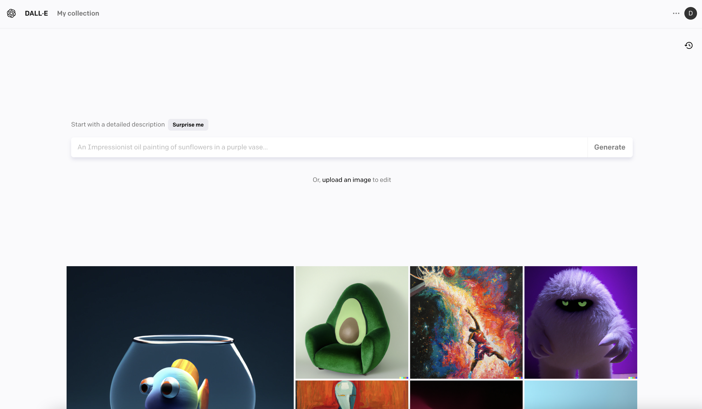
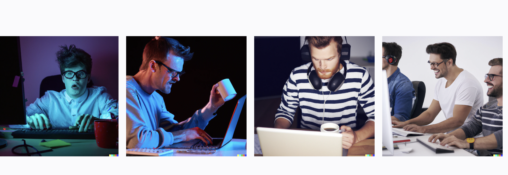

# KI und Kunst Workshop - Informatik Woche 2025 - Stiftschule Einsiedeln

## Lernziele

- Mit ETH-Studierenden über ihr Studium diskutieren und warum sie sich für ein technisches Studium entschieden haben
- Teschnische Studiengänge in der Schweiz besser kennen und verstehen
- Entdecken, was mit Programming alles möglich ist
- Verstehen der Grundlagen der KI
- Verstehen der Grundlagen der Programmierung in Python (z.B. Schreiben einer eigene Python-Funktion)
- Verstehen der Grundlagen der Digital Bildverarbeitung (z.B. RGB Kanäle, Filter, usw.)
- Verstehe das Konzept von Front-End und Back-End und deren Unterschiede
- Lerne, wie du an großen und langfristigen Projekten zusammenarbeitest

## Zeitplan

Der Workshop dauert von 9:00 bis 16:45 Uhr und gliedert sich in drei verschiedene Teile:

- 9:00 - 9:30: Vorstellung der Workshopleitern Sahana Betschen und Emanuel Skodinis (30 Minuten)
- 9:30 - 10:30: **Teil 1.A** - Einführung in Python und Digital Image Processing mit Google Colab (60 Minuten) - `IntroductionToAI/workshop_DE-Teil1.ipynb`
- 10:30 - 11:00: Pause 🤘🏼
- 11:00 - 11:45: **Teil 1.B** - Einführung in Python und Digital Image Processing mit Google Colab (45 Minuten) - `IntroductionToAI/workshop_DE-Teil2.ipynb`
- 11:45 - 12:00: Pause 🤘🏼
- 12:00 - 12:30: Vortrag über KI und Ethik (15 Minuten Präsentation und 15 Minuten Frage und Antwort)

&nbsp;

Mittagspausse 🍕
&nbsp;

- 13:30 - 14:00: **Teil 2.A** - Motivation: KI & Security (30 Minuten)
- 14:00 - 14:45: **Teil 2.B** - Einführung in KI in Python mit Google Colab (45 Minuten) - `IntroductionToAI/workshop_DE-Teil3.ipynb`
- 14:45 - 15:00: Pause 🤘🏼
- 15:00 - 15:20: Vortrag über andere Anwendungen von KI und die Grenzen von KI (10 Minuten Präsentation und 10 Minuten Frage und Antwort)
- 15:20 - 15:45: **Teil 3** - Dall-E, Generative AI Tools und Wrap-up (25 Minuten)
- 15:45 - 16:00: **Teil 4** - Feedback - https://forms.cloud.microsoft/e/C2kVrkus0C (15 Minuten)
- (Optional) **Teil 5.A** - Kaggle Challenge (45 Minuten)
- (Optional) **Teil 5.B** - Einführung in Android und Mobile App Entwicklung in Android mit Android Studio (60 Minuten)

## Teil 1 - Einführung in Python und Digital Image Processing mit Google Colab

- Öffne den Ordner `IntroductionToAI` und folge den Anweisungen im Dokument `README_DE.md`. Das Dokument gibt es auch auf Englisch - `README_ENG.md`. Einführung zu Python ist im Dokument: `IntroductionToAI/workshop_DE-Teil1.ipynb` und der zweite Teil zum Thema Bildbearbeitung ist in: `IntroductionToAI/workshop_DE-Teil2.ipynb`
  
[IntroductionToAI/workshop_DE-Teil1.ipynb](https://colab.research.google.com/github/girlscodetoo-ch/AI-Arts/blob/main/IntroductionToAI/workshop_DE-Teil1.ipynb)

[`IntroductionToAI/workshop_DE-Teil2.ipynb`](https://colab.research.google.com/github/girlscodetoo-ch/AI-Arts/blob/main/IntroductionToAI/workshop_DE-Teil2.ipynb)

## Teil 2.A - Motivation: KI & Security

https://gandalf.lakera.ai/do-not-tell

Intro in KI & Security!
## Teil 2.B - Einführung in KI in Python mit Google Colab

- Öffne den Ordner `IntroductionToAI` und folge den Anweisungen im Dokument `README_DE.md`. Das Dokument gibt es auch auf Englisch - `README_ENG.md`. Bitte öffne das Dokument: `IntroductionToAI/workshop_DE-Teil3.ipynb`. Sobald du damit fertig bist kannst du mit `IntroductionToAI/workshop_DE-Teil4.ipynb` weitermachen! Viel Spass!

## Teil 3 - Generative AI Tools

### Teil A - DALL-E (OpenAI)

DALL-E ist ein revolutionäres KI-Modell von OpenAI, das Text- und Bilderzeugung kombiniert und es den Benutzern ermöglicht, Bilder aus Textbeschreibungen zu erstellen. Dieses Tool ist eine faszinierende Möglichkeit, die Fähigkeiten moderner KI zu verstehen und die Schnittstelle zwischen Kreativität und Technologie zu erkunden. Es ist ideal, um die Vorstellungskraft anzuregen und die komplizierte Funktionsweise von generativen Modellen zu verstehen.

Meldet euch kostenfrei auf der [OpenAI-Website](https://openai.com/index/dall-e-3/) an, indem ihr auf "Sign-up" klickt.

Gebt eure E-Mail Adresse ein und folgt den Instruktionen auf der Website. Sobald ihr fertig seid mit dem anmelden, solltet ihr die foldende Seite sehen können:

Jetzt könnt ihr, wie beim Googlen, eine Serie an Worten eingeben und schauen was die KI euch zeigt! Viel Spass!

Zum Beispiel, wenn ihr "best coder of all time" eingebt solltet ihr folgende Bilder sehen: 

Was uns wieder zum Thema AI und Ethik führt das hier zum Beispeil einmal mehr nur "middle-aged white dudes" zu sehen sind!

### Teil B - [StableAudio](https://stableaudio.com/)

StableAudio ist ein bahnbrechendes KI-Tool, das die Macht der künstlichen Intelligenz nutzt, um Musik zu erzeugen. Es ermöglicht den Nutzern, durch Manipulation verschiedener musikalischer Elemente einzigartige und harmonische Musikstücke zu schaffen. Dieses Tool kann als überzeugende Einführung in die Anwendungen von KI im Bereich der Musik dienen und zeigt, wie Technologie kreative Prozesse in den Bereichen Klang und Komposition erweitern und aufwerten kann.

### Teil C - [ClipDrop Stable Diffusion](https://clipdrop.co/stable-diffusion?output=true)

ClipDrop Stable Diffusion ist ein fortschrittliches Werkzeug, das KI zur Verarbeitung und Manipulation von Bildern nutzt. Es ermöglicht den Nutzern, Bilder nahtlos zu überblenden und zu diffundieren, um visuell beeindruckende und künstlerisch reiche Kompositionen zu schaffen. Dieses Tool bietet Einblicke in das Potenzial von KI in der Bildverarbeitung und im Grafikdesign und zeigt, wie künstliche Intelligenz visuelle Ästhetik und künstlerischen Ausdruck verändern kann.

### Teil D - Experimentieren und ausprobieren

Diese Tools bieten einen Einblick in die vielfältige und weitreichende Welt der kreativen KI, die jeweils einzigartige Möglichkeiten und Lernchancen bietet. Ob es darum geht, phantasievolle Bilder zu erzeugen, melodische Melodien zu komponieren oder komplizierte Bildkompositionen zu erstellen, die SchülerInnen werden ermutigt, zu experimentieren und das grenzenlose Potenzial der KI im Bereich der Kreativität zu entdecken.

Erforschen Sie diese Tools und stellen Sie sich die Möglichkeiten vor, wie Sie künstliche Intelligenz in Ihre kreativen Projekte einbinden können!

## Teil 5 - Feedback

Bitte fülle [dieses Formular](https://forms.office.com/r/eug6Jjy7Uy) aus und sage uns, wie dir der Tag gefallen hat und was verbessert werden könnte.

## Kontakt

Wenn dir der Workshop gefallen hat und du deine Reise in die Technik fortsetzen möchtest. Bitte besuche unsere [Website](https://girlscodetoo.ch/) und schau dir die Kurse an, die wir das ganze Jahr über anbieten. Wir bieten dir auch Unterstützung und Beratung bei der Entscheidung, was du nach der High School machen willst!

Du kannst uns auch direkt kontaktieren unter: [info@girlscodetoo.ch](mailto:info@girlscodetoo.ch)

## Copyrights

Urheberrecht (C) 2023 - GirlsCodeToo
